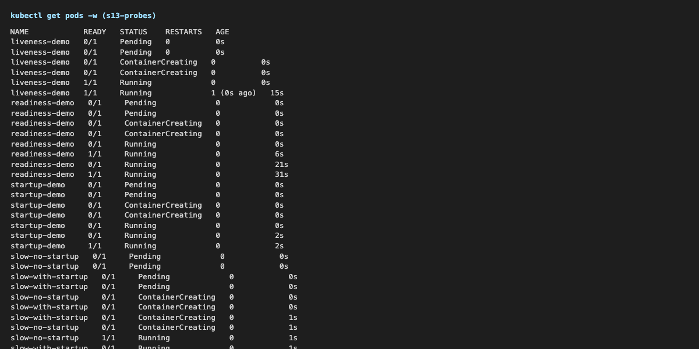
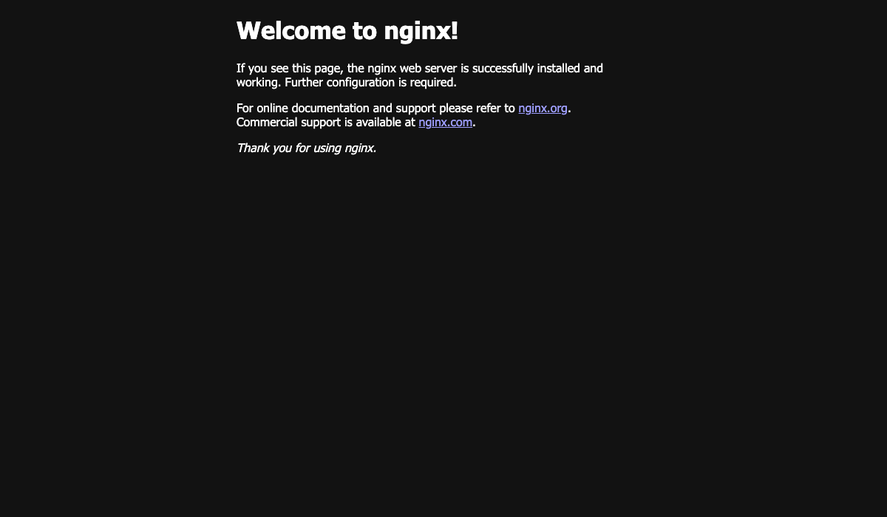
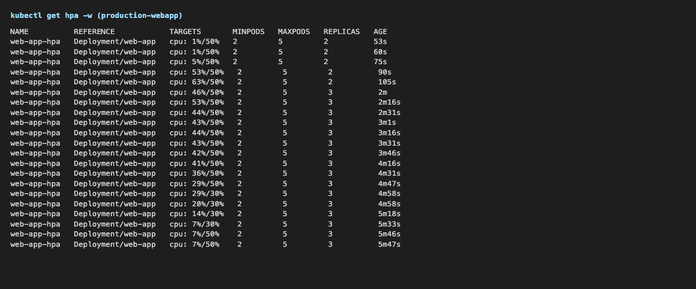

# Session 13 – Kubernetes Storage, HPA & Probes

**Name:** Kushal Talati  
**Enrollment No:** 24BCS10123  
**Environment:** kind v0.33.0 cluster `kushal-lab` (Kubernetes v1.37.0, 1 control-plane + 2 workers) on Docker Desktop 29.0.1, macOS / Apple Silicon – the same cluster as sessions 9–12. Default StorageClass `standard` (`rancher.io/local-path`, `WaitForFirstConsumer`). metrics-server v0.9.0 installed with `--kubelet-insecure-tls` (kind's kubelets use self-signed certs) so `kubectl top` and the HPA work. kubectl v1.34.1.

All manifests are the professor's from this session folder (`01-volumes/`, `02-persistent-storage/`, `03-storageclass/`, `04-hpa/`, `05-probes/`, `hpa/load_generator.sh`, `mini-project/`), used **unmodified**; where I had to change something it is shown as a `sed`/`awk`/`kubectl patch` in the command itself. Every command was really run; the exact commands are in [`scripts/`](scripts), the raw, unedited output in [`logs/`](logs), the `-w` streams and browser pages in [`screenshots/`](screenshots). Each lab runs in its own namespace (`s13-volumes`, `s13-hpa`, `s13-probes`, `production-webapp`) because the cluster is shared with my other session labs.

```text
kushal-24bcs10123/
├── README.md                      # this write-up
├── 01-kubernetes-volumes/
│   └── README.md                  # Task 1: emptyDir, hostPath, PV, PVC, StorageClass, dynamic provisioning (with output)
├── scripts/
│   ├── 01-volumes.sh              # every volume example from 01-volumes/, 02-persistent-storage/, 03-storageclass/
│   ├── 02-hpa.sh                  # Task 2: 04-hpa/ deployment + hpa.yaml, load, scale out, scale in
│   ├── 03-probes.sh               # 05-probes/ liveness, readiness, startup - and breaking each one
│   ├── 04-mini-project.sh         # Task 3: mini-project/ + the 3 bonus challenges
│   └── lib.sh
├── logs/
│   ├── 01-volumes.txt
│   ├── 02-hpa.txt   02-hpa-watch.txt            # `kubectl get hpa -w` for the whole 13 minutes
│   ├── 03-probes.txt   03-probes-watch.txt
│   └── 04-mini-project.txt   04-mini-hpa-watch.txt   04-mini-liveness-watch.txt
└── screenshots/
    ├── 02-hpa-watch.png   03-probes-watch.png   04-mini-hpa-watch.png
    └── 04-mini-webapp-browser.png
```

---

## 1. Task 1 – Kubernetes Volumes

Full write-up with the practical examples: **[01-kubernetes-volumes/README.md](01-kubernetes-volumes/README.md)**. Script: [scripts/01-volumes.sh](scripts/01-volumes.sh), log: [logs/01-volumes.txt](logs/01-volumes.txt).

What each example proved on the cluster:

| Volume | What I did | Result |
|---|---|---|
| `emptyDir` | wrote `/data/message.txt`, killed PID 1 (container restart), then deleted and re-created the pod | survived the container restart (`RESTARTS 1`, file still there); gone after the pod delete (`No such file or directory`) |
| `hostPath` | wrote a file, re-created the pod pinned to the *other* worker, then pinned back to the original | file visible on the node via `docker exec`; missing on `kushal-lab-worker2`; back again on `kushal-lab-worker` – a hostPath is one node's directory |
| `PersistentVolume` + `PersistentVolumeClaim` | `pv.yaml` (1Gi, Retain, hostPath) + `pvc.yaml` (500Mi) + `pod.yaml` | first attempt did **not** bind: the PVC got the default class `standard`; with `storageClassName: ""` it bound to `student-pv` (CLAIM `s13-volumes/student-pvc`), data survived pod deletion, claim got the whole 1Gi |
| reclaim policy `Retain` | deleted the PVC | PV went `Released`, a new identical PVC stayed `Pending` – manual cleanup needed |
| `StorageClass` + dynamic provisioning | `03-storageclass/pvc.yaml` with `storageClassName: standard` | `Pending`/`WaitForFirstConsumer` until a pod used it, then a PV `pvc-82f130ab-…` was created by `local-path-provisioner` on `kushal-lab-worker:/var/local-path-provisioner/…`; deleting the PVC deleted the PV (`Delete`) |

---

## 2. Task 2 – HPA hands-on (`04-hpa/`)

Script: [scripts/02-hpa.sh](scripts/02-hpa.sh), log: [logs/02-hpa.txt](logs/02-hpa.txt), watch: [logs/02-hpa-watch.txt](logs/02-hpa-watch.txt)

### 2.1 Deploy the application

`04-hpa/deployment.yaml` is one `nginx:1.27` replica with `requests.cpu: 100m` / `limits.cpu: 200m` – the request is what the HPA percentage is measured against (50 % = 50m per pod).

```text
$ kubectl -n s13-hpa apply -f 04-hpa/deployment.yaml && kubectl -n s13-hpa apply -f 04-hpa/service.yaml
deployment.apps/hpa-demo created
service/hpa-demo-service created
$ kubectl -n s13-hpa get deploy,svc,pods -o wide
deployment.apps/hpa-demo   1/1     1            1           1s    nginx        nginx:1.27   app=hpa-demo
service/hpa-demo-service   ClusterIP   10.96.153.173   <none>        80/TCP    1s    app=hpa-demo
pod/hpa-demo-5d6676989b-6prtx   1/1     Running   0          1s    10.244.3.117   kushal-lab-worker

$ kubectl get deploy metrics-server -n kube-system
metrics-server   1/1     1            1           11h
$ kubectl -n s13-hpa top pods
hpa-demo-5d6676989b-6prtx   5m           5Mi                 <- idle: 5m of a 100m request = 5%
```

### 2.2 Configure the HPA (`04-hpa/hpa.yaml`)

```yaml
apiVersion: autoscaling/v2
kind: HorizontalPodAutoscaler
metadata:
  name: hpa-demo
spec:
  scaleTargetRef: { apiVersion: apps/v1, kind: Deployment, name: hpa-demo }
  minReplicas: 1
  maxReplicas: 5
  metrics:
    - type: Resource
      resource:
        name: cpu
        target: { type: Utilization, averageUtilization: 50 }
```

```text
$ kubectl -n s13-hpa apply -f 04-hpa/hpa.yaml
$ kubectl -n s13-hpa describe hpa hpa-demo | sed -n '/^Metrics/,/^Events/p'
Metrics:                                               ( current / target )
  resource cpu on pods  (as a percentage of request):  0% (0) / 50%
Min replicas:                                          1
Max replicas:                                          5
Deployment pods:                                       1 current / 1 desired
Conditions:
  AbleToScale     True    ScaleDownStabilized  recent recommendations were higher than current one, applying the highest recent recommendation
  ScalingActive   True    ValidMetricFound     the HPA was able to successfully calculate a replica count from cpu resource utilization (percentage of request)
  ScalingLimited  False   DesiredWithinRange   the desired count is within the acceptable range
```

### 2.3 Load generator

Two generators were used. The in-cluster one is the course's `kubectl run load-generator` loop, three copies so nginx gets enough work:

```text
$ kubectl -n s13-hpa run load-generator-1 --image=busybox:1.36 --restart=Never -- /bin/sh -c 'while true; do wget -q -O- http://hpa-demo-service >/dev/null; done'
$ kubectl -n s13-hpa run load-generator-2 ...   (same)
$ kubectl -n s13-hpa run load-generator-3 ...   (same)
```

and the course host script `hpa/load_generator.sh` (10 parallel `curl` loops) through a `kubectl port-forward svc/hpa-demo-service 18080:80`, run for 60 s on top:

```text
$ bash hpa/load_generator.sh http://localhost:18080/ &
      KUBERNETES HPA TRAFFIC LOAD GENERATOR
Pounding target endpoint: http://localhost:18080/
Traffic load active! In another terminal, run: kubectl get hpa -w
(script and its 10 curl workers killed after 60 s - the loops are infinite by design)
$ kubectl -n s13-hpa top pods -l app=hpa-demo
hpa-demo-5d6676989b-6prtx   92m          6Mi                 <- the pod the port-forward happened to pick got almost double the others
hpa-demo-5d6676989b-f4ndj   45m          5Mi
hpa-demo-5d6676989b-qjkkw   41m          5Mi
hpa-demo-5d6676989b-r6jdc   46m          5Mi
hpa-demo-5d6676989b-zjxvw   40m          5Mi
```

(`kubectl port-forward` to a Service pins one pod, so the host script is not load-balanced – the in-cluster generators that go through the ClusterIP are.)

### 2.4 CPU utilization and pod scaling

`kubectl get hpa -w` for the whole run ([logs/02-hpa-watch.txt](logs/02-hpa-watch.txt), rendered in [screenshots/02-hpa-watch.png](screenshots/02-hpa-watch.png)):

```text
NAME       REFERENCE             TARGETS          MINPODS   MAXPODS   REPLICAS   AGE
hpa-demo   Deployment/hpa-demo   cpu: 0%/50%      1         5         1          20s
hpa-demo   Deployment/hpa-demo   cpu: 46%/50%     1         5         1          30s       <- load starts
hpa-demo   Deployment/hpa-demo   cpu: 200%/50%    1         5         1          45s       <- 200m used = the CPU *limit*, pod is throttled
hpa-demo   Deployment/hpa-demo   cpu: 132%/50%    1         5         4          60s       <- ceil(1 x 200/50) = 4 in one step
hpa-demo   Deployment/hpa-demo   cpu: 60%/50%     1         5         4          75s
hpa-demo   Deployment/hpa-demo   cpu: 54%/50%     1         5         5          90s       <- ceil(4 x 60/50) = 5 = max
hpa-demo   Deployment/hpa-demo   cpu: 49%/50%     1         5         5          105s
hpa-demo   Deployment/hpa-demo   cpu: 50%/50%     1         5         5          2m
...  48-52 % for the next 5 minutes with 5 replicas ...
hpa-demo   Deployment/hpa-demo   cpu: 13%/50%     1         5         5          7m16s     <- load generators deleted
hpa-demo   Deployment/hpa-demo   cpu: 0%/50%      1         5         5          7m31s
hpa-demo   Deployment/hpa-demo   cpu: 0%/50%      1         5         5          12m       <- 5-minute downscale stabilization window
hpa-demo   Deployment/hpa-demo   cpu: 0%/50%      1         5         2          12m
hpa-demo   Deployment/hpa-demo   cpu: 0%/50%      1         5         1          12m       <- back to minReplicas
```

`kubectl top pods` and `kubectl get pods` sampled every 30 s while the load ran:

```text
--- t+30s
hpa-demo-5d6676989b-6prtx   200m         6Mi             <- one pod, pinned at its 200m limit
   hpa-demo-5d6676989b-6prtx Running
   hpa-demo-5d6676989b-f4ndj Running                     <- 3 new pods already created
   hpa-demo-5d6676989b-qjkkw Running
   hpa-demo-5d6676989b-r6jdc Running
--- t+60s
hpa-demo-5d6676989b-6prtx   59m          6Mi
hpa-demo-5d6676989b-f4ndj   63m          5Mi
hpa-demo-5d6676989b-qjkkw   57m          5Mi
hpa-demo-5d6676989b-r6jdc   62m          5Mi
   ... 5 pods Running
--- t+120s ... t+300s
hpa-demo-5d6676989b-6prtx   48m          6Mi             <- 5 pods at 47-55m each = the same total work,
hpa-demo-5d6676989b-f4ndj   54m          5Mi                spread so every pod sits right at the 50% target
hpa-demo-5d6676989b-qjkkw   49m          5Mi
hpa-demo-5d6676989b-r6jdc   55m          5Mi
hpa-demo-5d6676989b-zjxvw   49m          5Mi
```

```text
$ kubectl -n s13-hpa describe hpa hpa-demo | sed -n '/^Metrics/,$p'
Metrics:                                               ( current / target )
  resource cpu on pods  (as a percentage of request):  49% (49m) / 50%
Deployment pods:                                       5 current / 5 desired
Conditions:
  AbleToScale     True    ReadyForNewScale    recommended size matches current size
  ScalingActive   True    ValidMetricFound    ...
  ScalingLimited  False   DesiredWithinRange  the desired count is within the acceptable range
Events:
  Warning  FailedGetResourceMetric       5m24s  horizontal-pod-autoscaler  failed to get cpu utilization: did not receive metrics for targeted pods (pods might be unready)
  Normal   SuccessfulRescale             4m39s  horizontal-pod-autoscaler  New size: 4; reason: cpu resource utilization (percentage of request) above target
  Normal   SuccessfulRescale             4m9s   horizontal-pod-autoscaler  New size: 5; reason: cpu resource utilization (percentage of request) above target
$ kubectl -n s13-hpa get deploy hpa-demo
hpa-demo   5/5     5            5           5m45s
```

### 2.5 Scale-down

```text
$ kubectl -n s13-hpa delete pod load-generator-1 load-generator-2 load-generator-3 --wait=false
--- t+30s after load stopped    pods: 5
...
--- t+330s after load stopped   pods: 5
--- t+360s after load stopped   pods: 1                 <- just after the 300 s stabilization window
$ kubectl -n s13-hpa describe hpa hpa-demo | sed -n '/^Events/,$p'
  Normal   SuccessfulRescale   88s   horizontal-pod-autoscaler  New size: 2; reason: All metrics below target
  Normal   SuccessfulRescale   73s   horizontal-pod-autoscaler  New size: 1; reason: All metrics below target
```

Scale-up happened within 30 s of the load and jumped straight to 4 (the controller computes `ceil(current × usage/target)`, it does not add one at a time). Scale-down waited the default `stabilizationWindowSeconds: 300` and then went 5 → 2 → 1 in two 15-second ticks. The one `FailedGetResourceMetric` warning is from the first 15 s after creating the HPA, before metrics-server had a sample for the pod.

---

## 3. Probes (`05-probes/`)

Script: [scripts/03-probes.sh](scripts/03-probes.sh), log: [logs/03-probes.txt](logs/03-probes.txt), watch: [logs/03-probes-watch.txt](logs/03-probes-watch.txt), 

The three course manifests all probe `GET / :80` on nginx. To see each probe *fail* I deleted `index.html` inside the running container, which makes nginx answer `403` on `/`.

```text
# liveness -> restart
$ kubectl -n s13-probes exec liveness-demo -- rm /usr/share/nginx/html/index.html
$ kubectl -n s13-probes exec liveness-demo -- curl -s -o /dev/null -w 'nginx now answers %{http_code}\n' localhost/
nginx now answers 403
$ sleep 30; kubectl -n s13-probes get pod liveness-demo
liveness-demo   1/1     Running   1 (16s ago)   31s
  Warning  Unhealthy  16s (x3 over 26s)  kubelet  Liveness probe failed: HTTP probe failed with statuscode: 403     <- failureThreshold 3 x period 5s
  Normal   Killing    16s                kubelet  Container nginx failed liveness probe, will be restarted
after restart: 200                                                             <- fresh container from the image, index.html is back

# readiness -> out of the Service, no restart
$ kubectl -n s13-probes expose pod readiness-demo --name=readiness-service --port=80
readiness-service   10.244.3.24:80
$ kubectl -n s13-probes exec readiness-demo -- rm /usr/share/nginx/html/index.html
$ sleep 20; kubectl -n s13-probes get pod readiness-demo
readiness-demo   0/1     Running   0          26s                              <- READY 0/1, RESTARTS still 0
$ kubectl -n s13-probes get endpoints readiness-service
readiness-service               20s                                            <- endpoint list empty
$ kubectl -n s13-probes exec readiness-demo -- sh -c 'echo ok > /usr/share/nginx/html/index.html'
readiness-demo   1/1     Running   0          39s
readiness-service   10.244.3.24:80                                             <- back, without a restart

# startup
    Startup:        http-get http://:80/ delay=0s timeout=1s period=2s #success=1 #failure=30
    Liveness:       http-get http://:80/ delay=0s timeout=1s period=5s #success=1 #failure=3
```

To see what the startup probe is *for*, two busybox pods that need 40 s to "start" (`sleep 40; touch /tmp/up`) with an `exec cat /tmp/up` liveness probe, one with and one without a startup probe:

```text
$ sleep 70; kubectl -n s13-probes get pods slow-no-startup slow-with-startup
slow-no-startup     1/1     Running   1 (24s ago)   70s        <- liveness killed it at ~15 s, before the app was up
slow-with-startup   1/1     Running   0             70s        <- startup probe (30 x 2 s budget) held liveness off until /tmp/up existed
```

---

## 4. Task 3 – Mini project (`mini-project/`)

Script: [scripts/04-mini-project.sh](scripts/04-mini-project.sh), log: [logs/04-mini-project.txt](logs/04-mini-project.txt)

Namespace `production-webapp`: a 500Mi RWO PVC mounted at `/data`, a 2-replica nginx Deployment (`strategy: Recreate`, requests 100m/64Mi, limits 200m/128Mi, startup + readiness + liveness probes), a ClusterIP Service and an HPA 2–5 at 50 % CPU.

### 4.1 Deployment (steps 5.1–5.4)

```text
$ kubectl apply -f namespace.yaml && kubectl apply -f pvc.yaml
$ kubectl -n production-webapp get pvc
web-data   Pending                                      standard             <- WaitForFirstConsumer
$ kubectl apply -f deployment.yaml && kubectl apply -f service.yaml
$ kubectl -n production-webapp get pods -o wide
web-app-d45775485-p5z8n   1/1     Running   0          13s   10.244.1.72   kushal-lab-worker2
web-app-d45775485-v2pv4   1/1     Running   0          13s   10.244.1.73   kushal-lab-worker2
$ kubectl -n production-webapp get pvc
web-data   Bound    pvc-29fa93cd-8aba-479b-bcd0-060f64922daf   500Mi      RWO            standard
$ kubectl apply -f hpa.yaml; sleep 30; kubectl -n production-webapp get hpa
web-app-hpa   Deployment/web-app   cpu: 1%/50%   2         5         2          30s
```

Both replicas landed on `kushal-lab-worker2`: the PVC is `ReadWriteOnce` on node-local storage, so once the first pod bound it the second pod could only be scheduled on the same node (RWO is per *node*, not per pod).

### 4.2 Task 1 – storage persistence

```text
$ kubectl -n production-webapp exec web-app-d45775485-p5z8n -- sh -c 'echo "Student: Kushal Talati (24BCS10123)" > /data/student.txt'
$ kubectl -n production-webapp exec web-app-d45775485-p5z8n -- cat /data/student.txt
Student: Kushal Talati (24BCS10123)
$ kubectl -n production-webapp delete pod web-app-d45775485-p5z8n
$ kubectl -n production-webapp get pods
web-app-d45775485-hstmg   1/1     Running   0          10s                      <- replacement pod
web-app-d45775485-v2pv4   1/1     Running   0          55s
$ kubectl -n production-webapp exec web-app-d45775485-hstmg -- cat /data/student.txt
Student: Kushal Talati (24BCS10123)                                             <- same PVC, same file
$ kubectl -n production-webapp exec web-app-d45775485-v2pv4 -- cat /data/student.txt
Student: Kushal Talati (24BCS10123)                                             <- the other replica sees it too
```

### 4.3 Task 2 – service verification

```text
$ kubectl -n production-webapp port-forward svc/web-service 18081:80 &
$ curl -s http://localhost:18081 | head -5
<!DOCTYPE html>
<html>
<head>
<title>Welcome to nginx!</title>
```



### 4.4 Task 3 – HPA elastic scaling

Watch: [logs/04-mini-hpa-watch.txt](logs/04-mini-hpa-watch.txt), 

```text
$ kubectl -n production-webapp run load-generator-1 --image=busybox:1.36 --restart=Never -- /bin/sh -c 'while true; do wget -q -O- http://web-service >/dev/null; done'
  (+ load-generator-2, load-generator-3)
--- t+30s   web-app-hpa   Deployment/web-app   cpu: 5%/50%    2   5   2
            web-app-d45775485-hstmg   43m   5Mi
            web-app-d45775485-v2pv4   64m   5Mi
--- t+60s   web-app-hpa   Deployment/web-app   cpu: 63%/50%   2   5   2
--- t+90s   web-app-hpa   Deployment/web-app   cpu: 53%/50%   2   5   3          <- scaled 2 -> 3
            web-app-d45775485-hstmg   45m   5Mi
            web-app-d45775485-ngmgg   44m   5Mi
            web-app-d45775485-v2pv4   45m   5Mi
--- t+120s  web-app-hpa   Deployment/web-app   cpu: 44%/50%   2   5   3
...
--- t+240s  web-app-hpa   Deployment/web-app   cpu: 29%/50%   2   5   3
$ kubectl -n production-webapp describe hpa web-app-hpa | sed -n '/^Events/,$p'
  Normal   SuccessfulRescale   3m13s  horizontal-pod-autoscaler  New size: 3; reason: cpu resource utilization (percentage of request) above target
```

Three busybox `wget` loops only pushed two nginx pods to ~63 %, so the HPA added exactly one replica (`ceil(2 × 63/50) = 3`) and utilization settled at 44 % – below target, so no further scale-up. The generators here were the bottleneck (each busybox used ~500m CPU to produce the requests, the nginx pods ~45m to answer them), which is a fair lesson about load tests: the HPA scales the *target's* utilization, not the traffic you think you are sending.

### 4.5 Bonus challenges

**Challenge 1 – target 50 % → 30 %**

```text
$ sed 's/averageUtilization: 50/averageUtilization: 30/' hpa.yaml | kubectl apply -f -
$ sleep 45; kubectl -n production-webapp get hpa web-app-hpa
web-app-hpa   Deployment/web-app   cpu: 7%/30%   2         5         3          5m44s
```

By the time the lower target was applied the load had already fallen off (7 %), so the lower threshold showed as a tighter target but did not trigger a scale-up; with the earlier 63 % reading a 30 % target would have asked for `ceil(2 × 63/30) = 5` replicas in one step instead of 3. Target restored to 50 % afterwards.

**Challenge 2 – readiness path `/does-not-exist`** (watch of the rollout in the log)

```text
$ kubectl -n production-webapp patch deploy web-app --type=json -p='[{"op":"replace","path":"/spec/template/spec/containers/0/readinessProbe/httpGet/path","value":"/does-not-exist"}]'
$ sleep 40; kubectl -n production-webapp get pods -l app=web-app
web-app-5945bfc776-j5tpc   0/1     Running   0          36s
web-app-5945bfc776-tvr9v   0/1     Running   0          36s
web-app-5945bfc776-wh85r   0/1     Running   0          36s
$ kubectl -n production-webapp get endpoints web-service
web-service               6m44s                                         <- completely empty
$ kubectl -n production-webapp describe deploy web-app | grep -E 'Readiness|Replicas:'
Replicas:           3 desired | 3 updated | 3 total | 0 available | 3 unavailable
    Readiness:    http-get http://:80/does-not-exist delay=5s timeout=2s period=5s #success=1 #failure=2
```

Pods `Running`, `READY 0/1`, no restarts, and the Service has nobody to send traffic to. (Because the strategy is `Recreate`, the old healthy pods were already gone before the new ones failed readiness – a rolling update with `maxUnavailable: 0` would have refused to proceed.)

**Challenge 3 – liveness path `/crash`** (watch: [logs/04-mini-liveness-watch.txt](logs/04-mini-liveness-watch.txt))

```text
$ kubectl -n production-webapp patch deploy web-app --type=json -p='[{"op":"replace","path":"/spec/template/spec/containers/0/livenessProbe/httpGet/path","value":"/crash"}]'
web-app-85d86b65d-78pqq   1/1     Running             0             11s
web-app-85d86b65d-78pqq   0/1     Running             1 (2s ago)    23s
web-app-85d86b65d-78pqq   1/1     Running             1 (10s ago)   31s
web-app-85d86b65d-78pqq   0/1     Running             2 (2s ago)    43s
web-app-85d86b65d-78pqq   1/1     Running             2 (9s ago)    50s
web-app-85d86b65d-78pqq   0/1     Running             3 (1s ago)    62s
$ kubectl -n production-webapp describe pods -l app=web-app | grep -E 'Liveness probe failed|Restart Count' | sort | uniq -c
   2 Restart Count:  3
   2 Warning  Unhealthy  4s (x10 over 64s)  kubelet  Liveness probe failed: HTTP probe failed with statuscode: 404
```

A restart every ~20 s: `initialDelaySeconds 5` + 3 failures × `periodSeconds 5`, exactly as the deployment spec says. Re-applying the professor's `deployment.yaml` brought everything back to `2/2` and the namespace was deleted at the end.

---

## Lab completion checklist

- [x] `emptyDir`, `hostPath`, `PersistentVolume`, `PersistentVolumeClaim`, `StorageClass`, dynamic provisioning – each applied, written to, and tested across container restart / pod delete / node change ([01-kubernetes-volumes/README.md](01-kubernetes-volumes/README.md))
- [x] HPA: application deployed, `hpa.yaml` applied, verified with `kubectl get hpa` / `describe hpa`, load generated (in-cluster loops + `hpa/load_generator.sh`), `kubectl top pods` observed, scaling 1 → 4 → 5 and 5 → 2 → 1 captured in `02-hpa-watch.txt` and the screenshot
- [x] Liveness, readiness and startup probes run from `05-probes/` and each one made to fail on purpose; startup-probe benefit shown with a slow starter
- [x] Mini project: namespace, PVC, Deployment with 3 probes, Service, HPA; persistence across pod deletion, browser/curl check, scale-out under load, challenges 1–3
- [x] All namespaces removed afterwards

## What I understood

* A volume's type is really a statement about **lifetime**: emptyDir = pod, hostPath = node, PV = its own object with a reclaim policy. The pod only ever says "mount this claim", which is what makes the same YAML portable across clusters.
* A default StorageClass changes the meaning of a plain PVC: without `storageClassName: ""` it is a request for dynamic storage and will ignore a hand-made PV. `Pending` + `WaitForFirstConsumer` is the normal state of a dynamic claim until a pod needs it.
* `ReadWriteOnce` is enforced per node – two replicas can share an RWO volume if the scheduler puts them on the same node, and then the volume silently pins the whole Deployment to that node.
* The HPA is arithmetic on `requests.cpu`: `desired = ceil(current × usage/target)`. It jumps (1 → 4) rather than creeping, holds for 300 s before scaling in, and cannot see anything if `requests` are missing or metrics-server is not there (`<unknown>`). CPU *limits* cap what a single pod can show (200 % = 200m limit on a 100m request).
* The three probes answer three different questions and have three different consequences: startup → "wait, don't judge yet" (holds the other two off), readiness → "not now" (removed from endpoints, no restart), liveness → "dead" (container restarted). A readiness probe that always fails takes the whole Service offline while every pod says `Running`.
* Load generators are part of the system: in the mini project the generators ate ten times the CPU of the pods they were loading, so the HPA (correctly) only added one replica. Watch `kubectl top` on both sides before trusting a scaling result.
